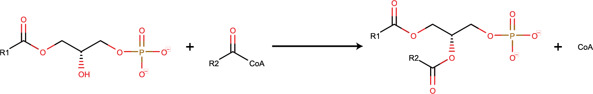

```{r, include = FALSE}
knitr::opts_chunk$set(
  collapse = TRUE,
  comment = "#>",
  warning = FALSE
)
```

This vignette describes the complete workflow for the prediction of <i>Caenorhabditis elegans</i> (<i>C. elegans</i>) lipids performed by Witting et al. (in preparation). Input are fatty acids that were shown to be present in <i>C. elegans</i> by different groups. A consenus list was generated based on fatty acids from WormJam and detected in <i>C. elegans</i>. A data frame of these fatty acids is supplied with this package.

```{r setup}
# load required library
library(wormLipidPredictR)
library(tidyverse)
library(rgoslin)
```

In order to store all the results a data frame for the reactions is created. Lipids abbreviations are just appended to each other.

```{r data structures, message=FALSE, warning=FALSE}
# create data frame to store reactions
lipid_reactions <- data.frame()

# create vector to store shorthand notations of generated lipids
lipid_abbrev <- vector()

lipid_df <- tibble()
```


Fatty acids used in glycero- and glycerophospholipids are different from the ones used in sphingolipid biosynthesis. The pools are only partially overlapping between the two. Therefore two different files for the two different pools are supplied.
The following lines read the fatty acids into a data frame and isolates the shorthand notation of the fatty acids, which are further used for downstream processing.

```{r fatty acids 1, message=FALSE, warning=FALSE}
# read data frame with fatty acids detected in C. elegans
fatty_acid_gl_gp_df <- data.frame(read.table(system.file("extdata",
                                                   "celegans_fatty_acids_GL_GP.txt",
                                                   package="wormLipidPredictR"),
                                       sep = "\t",
                                       header = TRUE,
                                       comment.char = "",
                                       stringsAsFactors = FALSE))

# get short hand notations for fatty acids
FAs_GPGL <- fatty_acid_gl_gp_df$shorthand

lipid_info <- parseLipidNames(FAs_GPGL)

# add lipids to data frame
# lipid_df <- bind_rows(lipid_df, tibble(class = "FA",
#                                        category = "FA01",
#                                        shorthand = FAs_GPGL))

lipid_df <- bind_rows(lipid_df, lipid_info)
```

The lines below perform the same action for fatty acids used in sphingolipid biosynthesis.

```{r fatty acids 2, message=FALSE, warning=FALSE}
# read data frame with fatty acids detected in C. elegans
fatty_acid_sph_df <- data.frame(read.table(system.file("extdata",
                                                   "celegans_fatty_acids_SPH.txt",
                                                   package="wormLipidPredictR"),
                                       sep = "\t",
                                       header = TRUE,
                                       comment.char = "",
                                       stringsAsFactors = FALSE))

# get short hand notations for fatty acids
FAs_SPH <- fatty_acid_sph_df$shorthand

lipid_info <- parseLipidNames(FAs_SPH)

# add lipids to data frame
# lipid_df <- bind_rows(lipid_df, tibble(class = "FA",
#                                        category = "FA01",
#                                        shorthand = FAs_GPGL))

lipid_df <- bind_rows(lipid_df, lipid_info)
```


## Block 0: Preparation of Acyl-CoAs

### Biosynthesis of CoAs from FAs

{width=500px}

Acyl groups are transfered in their activate form of acyl CoAs (CoAs). Their synthesis requires ATP. <i>C. elegans</i> harbors different Acyl-CoA synthetases and their substrate specificity is not established so far. In order to be able to use all defined acyls they are converted to acyl CoAs. For each reaction, a specific function that converts one lipid into another based on a template reaction have been implemented. The basic reaction is hardcoded in the function itself, but additional information can supplied via a <code>list</code>, e.g. gene associations etc. This information can be obtained from WormJam.

```{r fa to CoAs_GPGL, message=FALSE, warning=FALSE}
# template for reaction --------------------------------------------------------
template <- list(reaction_name = "CoA biosynthesis",
                 reaction_formula = "M_atp + M_coa + M_fatacid <=> M_ppi + M_amp + M_fataccoa",
                 reaction_isReversible = "",
                 reaction_geneAssociation = "",
                 reaction_pathway = "Acyl-CoA synthetase")
```

The first reaction converts fatty acids (FAs) to acyl-CoAs. Each reaction returns a list with multiple elements. The last element contains the new non-generic reactions, whereas the first contain the shorthand notation of all newly generated lipids. Since the shorthand notations are required furhter downstream, they are additionally stored object with the name of the respective lipid class.
The lines below generate acyl-CoAs for fatty acids found to be present in glycero- and glycerophospholipids.

```{r, message=FALSE, warning=FALSE}
# convert fatty acids to acyl CoAs ---------------------------------------------
results <- fa_to_coa(FAs_GPGL, template = template)

# add new lipids to lipid vector
lipid_abbrev <- c(lipid_abbrev,
                  results[[1]])

# get CoAs for further reactions (glycero- and glycerophospholipids)
CoAs_GPGL <- results[[1]]

# add new reactions to reaction data frame
lipid_reactions <- rbind.data.frame(lipid_reactions,
                                    results[[2]])

lipid_info <- parseLipidNames(CoAs_GPGL)

# add lipids to data frame
# lipid_df <- bind_rows(lipid_df, tibble(class = "FA",
#                                        category = "FA01",
#                                        shorthand = FAs_GPGL))

lipid_df <- bind_rows(lipid_df, lipid_info)
```

### Biosynthesis of CoAs for Ceramide biosynthesis

{width=500px}

Likewise, the fatty acyls for the synthesis of sphingolipids are required as acy-CoAs.

```{r, message=FALSE, warning=FALSE}
# convert fatty acids to acyl CoAs ---------------------------------------------
results <- fa_to_coa(FAs_SPH, template = template)

# add new lipids to lipid vector
lipid_abbrev <- c(lipid_abbrev,
                  results[[1]])

# get CoAsfor further reactions (sphingolipids)
CoAs_SPH <- results[[1]]

# add new reactions to reaction data frame
lipid_reactions <- rbind.data.frame(lipid_reactions,
                                    results[[2]])

lipid_info <- parseLipidNames(CoAs_SPH)

# add lipids to data frame
# lipid_df <- bind_rows(lipid_df, tibble(class = "FA",
#                                        category = "FA01",
#                                        shorthand = FAs_GPGL))

lipid_df <- bind_rows(lipid_df, lipid_info)
```

## Block 1: Biosynthesis and Degradation of Phosphaditic acid and Diacylglycerol

Diacylgylcerols (DGs) are an important intermediate for the biosynthesis of different lipids. The represent a branching point between triacylglycerols and glycerophospholipids. They are synthesized from lysosphosphaditic and phosphaditic acid by successive acylation of glycerol 3-phosphate. The first block of reactions handles the generation of PAs and DGs as well as their metabolism via monoacylglycerols to fatty acids.

### Biosynthesis of LPAs

{width=500px}

The first step to obtain DGs is the biosynthesis of lysophophaditic acid from acyl CoAs_GPGL and glycerol 3-phosphate. This reaction takes place in the ER and the mitochondria. In the ER the reaction is catalyzed by acl-5 (WBGene00011106) or acl-6 (WBGene00017261), while in the mitochondria acl-4 (WBGene00018657) is used. No subcellular specificity is currently used, therefore the assignments are merged together to yield a single reaction.

```{r, message=FALSE, warning=FALSE}
# template for reaction --------------------------------------------------------
template <- list(reaction_name = "glycerol-3 phosphate acyl transferase",
                 reaction_formula = "M_fataccoa + M_alpa_pl <=> M_coa + M_pa_pl",
                 reaction_isReversible = "FALSE",
                 reaction_geneAssociation = "WBGene00017261 or WBGene00018657 or WBGene00011106",
                 reaction_pathway = "Biosynthesis and Degradation of Phosphaditic acid and Diacylglycerol")
```

```{r, message=FALSE, warning=FALSE}
# biosynthesis of LPAs ---------------------------------------------------------
results <- coa_to_lpa(CoAs_GPGL, template = template, constraints = c(""), negate = c(FALSE))

# add new lipids to lipid vector
lipid_abbrev <- c(lipid_abbrev,
                  results[[1]])

# get CoAs_GPGL for further reactoins
LPAs <- results[[1]]

# add new reactions to reaction data frame
lipid_reactions <- rbind.data.frame(lipid_reactions,
                                    results[[2]])

lipid_info <- parseLipidNames(LPAs)

# add lipids to data frame
# lipid_df <- bind_rows(lipid_df, tibble(class = "FA",
#                                        category = "FA01",
#                                        shorthand = FAs_GPGL))

lipid_df <- bind_rows(lipid_df, lipid_info)
```

### Biosynthesis of PAs

In the next step a second acyl group is transferred to the LPA to produce PA. This reaction is catalyzed by acl-9 (WBGene00022646) or acl-8 (WBGene00020264) or mboa-3 (WBGene00016934) or acl-1 (WBGene00010339) or acl-2 (WBGene00011543) in the ER. For the mitochondrial counterpart no genes are known so far. acl-3 (WBGene00006491) might be a good candidate since it is predicted to locate in the mitochondria.

{width=500px}

```{r, message=FALSE, warning=FALSE}
# template for reaction --------------------------------------------------------
template <- list(reaction_name = "lysophosphatidic acid acyl transferase",
                 reaction_formula = "M_fataccoa + M_alpa_pl <=> M_coa + M_pa_pl",
                 reaction_isReversible = "FALSE",
                 reaction_geneAssociation = "WBGene00022646 or WBGene00020264 or WBGene00016934 or WBGene00010339 or WBGene00011543",
                 reaction_pathway = "Biosynthesis and Degradation of Phosphaditic acid and Diacylglycerol")
```

```{r, message=FALSE, warning=FALSE}
# biosynthesis of PAs ----------------------------------------------------------
results <- lpa_to_pa(LPAs, CoAs_GPGL, template = template, constraints = c("", ""), negate = c(FALSE, FALSE))

# add new lipids to lipid vector
lipid_abbrev <- c(lipid_abbrev,
                  results[[1]])

# get CoAs_GPGL for further reactoins
PAs <- results[[1]]

# add new reactions to reaction data frame
lipid_reactions <- rbind.data.frame(lipid_reactions,
                                    results[[2]])

lipid_info <- parseLipidNames(PAs)

# add lipids to data frame
# lipid_df <- bind_rows(lipid_df, tibble(class = "FA",
#                                        category = "FA01",
#                                        shorthand = FAs_GPGL))

lipid_df <- bind_rows(lipid_df, lipid_info)
```

### Biosynthesis of DGs

Diacylglycerols are produced from PAs by dephosphorylation. DGs are important intermediates for biosynthesis of glycerophospholipids or triacylglycerols. A prominent enzyme catalyzing this reactions is LPIN-1.
Plasma membrane or ER WBGene00008749 or WBGene00018756 or WBGene00020895 or WBGene00010425

nucleus WBGene00010425

```{r, message=FALSE, warning=FALSE}
# template for reaction --------------------------------------------------------
template <- list(reaction_name = "1,2-diacyl-sn-glycerol 3-phosphate phosphohydrolase (ER)",
                 reaction_formula = "M_h2o +  M_pa_pl <=> M_pi + M_12dag",
                 reaction_isReversible = "FALSE",
                 reaction_geneAssociation = "WBGene00008749 or WBGene00018756 or WBGene00020895 or WBGene00010425",
                 reaction_pathway = "Biosynthesis and Degradation of Phosphaditic acid and Diacylglycerol")
```

```{r, message=FALSE, warning=FALSE}
results <- pa_to_dg(PAs, template = template)

# add new lipids to lipid vector
lipid_abbrev <- c(lipid_abbrev,
                  results[[1]])

# get CoAs_GPGL for further reactoins
DGs <- results[[1]]

# add new reactions to reaction data frame
lipid_reactions <- rbind.data.frame(lipid_reactions,
                                    results[[2]])

lipid_info <- parseLipidNames(DGs)

# add lipids to data frame
# lipid_df <- bind_rows(lipid_df, tibble(class = "FA",
#                                        category = "FA01",
#                                        shorthand = FAs_GPGL))

lipid_df <- bind_rows(lipid_df, lipid_info)
```

### DG Kinase

add reaction
WBGene00000958 or WBGene00000959 or WBGene00000960 or WBGene00006483 or WBGene00019428

```{r, message=FALSE, warning=FALSE}
# template for reaction --------------------------------------------------------
template <- list(reaction_name = "1,2-diacyl-sn-glycerol kinase (ER)",
                 reaction_formula = "M_atp +  M_12dag <=> M_h + M_adp + M_pa_pl",
                 reaction_isReversible = "FALSE",
                 reaction_geneAssociation = "WBGene00000958 or WBGene00000959 or WBGene00000960 or WBGene00006483 or WBGene00019428",
                 reaction_pathway = "Biosynthesis and Degradation of Phosphaditic acid and Diacylglycerol")
```

```{r, message=FALSE, warning=FALSE}
results <- dg_to_pa(DGs, template = template)

# check if produced PAs are in previous list
if(all(results[[1]] %in% PAs)) {
  
    print("all fine...")
  
  # add new reactions to reaction data frame
  lipid_reactions <- rbind.data.frame(lipid_reactions,
                                      results[[2]])

}
```

### Degradation of DGs

Production of 1-MG

```{r, message=FALSE, warning=FALSE}
# template for reaction --------------------------------------------------------
#template <- list(reaction_name = "1,2-diacyl-sn-glycerol acylhydrolase (1-acyl-MG)",
#                 reaction_formula = "M_h2o_c +  M_12dag_c <=> M_h_c + M_fatacid_c + M_1magol_c",
#                 reaction_isReversible = "FALSE",
#                 reaction_geneAssociation = "",
#                 reaction_pathway = "Biosynthesis and Degradation of Phosphaditic acid and Diacylglycerol")
```

```{r, message=FALSE, warning=FALSE}
#results <- dg_to_sn1mg(DGs, template = template)

# add new lipids to lipid vector
#lipid_abbrev <- c(lipid_abbrev,
#                  results[[1]])

# get CoAs_GPGL for further reactoins
#sn1MGs <- results[[1]]

# add new reactions
#lipid_reactions <- rbind.data.frame(lipid_reactions,
#                                    results[[2]])
```

Production of 2-MG

```{r, message=FALSE, warning=FALSE}
# template for reaction --------------------------------------------------------
template <- list(reaction_name = "1,2-diacyl-sn-glycerol acylhydrolase (2-acyl-MG)",
                 reaction_formula = "M_h2o_c +  M_12dag_c <=> M_h_c + M_fatacid_c + M_mag_c",
                 reaction_isReversible = "FALSE",
                 reaction_geneAssociation = "WBGene00015484 or WBGene00016704",
                 reaction_pathway = "Biosynthesis and Degradation of Phosphaditic acid and Diacylglycerol")
```

```{r, message=FALSE, warning=FALSE}
results <- dg_to_sn2mg(DGs, template = template)

# add new lipids to lipid vector
lipid_abbrev <- c(lipid_abbrev,
                  results[[1]])

# get CoAs_GPGL for further reactoins
sn2MGs <- results[[1]]

# add new reactions
lipid_reactions <- rbind.data.frame(lipid_reactions,
                                    results[[2]])

lipid_info <- parseLipidNames(sn2MGs)

# add lipids to data frame
# lipid_df <- bind_rows(lipid_df, tibble(class = "FA",
#                                        category = "FA01",
#                                        shorthand = FAs_GPGL))

lipid_df <- bind_rows(lipid_df, lipid_info)
```

sn2MGs to sn1MGs

```{r, message=FALSE, warning=FALSE}
# template for reaction --------------------------------------------------------
template <- list(reaction_name = "1-Acyl-MG 2-Acyl-MG conversion",
                 reaction_formula = "M_mag <=> M_1magol",
                 reaction_isReversible = "FALSE",
                 reaction_geneAssociation = "",
                 reaction_pathway = "Biosynthesis and Degradation of Phosphaditic acid and Diacylglycerol")
```

```{r, message=FALSE, warning=FALSE}
results <- sn2mg_to_sn1mg(sn2MGs, template = template)

# add new lipids to lipid vector
lipid_abbrev <- c(lipid_abbrev,
                  results[[1]])

# get CoAs_GPGL for further reactoins
sn1MGs <- results[[1]]

# add new reactions
lipid_reactions <- rbind.data.frame(lipid_reactions,
                                    results[[2]])

lipid_info <- parseLipidNames(sn1MGs)

# add lipids to data frame
# lipid_df <- bind_rows(lipid_df, tibble(class = "FA",
#                                        category = "FA01",
#                                        shorthand = FAs_GPGL))

lipid_df <- bind_rows(lipid_df, lipid_info)
```


### Degradation of MGs

sn1MGs to Fa

```{r, message=FALSE, warning=FALSE}
# template for reaction --------------------------------------------------------
template <- list(reaction_name = "1-acyl-sn-glycerol acylhydrolase",
                 reaction_formula = "M_h2o + M_1magol <=> M_glyc + M_h + M_fatacid",
                 reaction_isReversible = "FALSE",
                 reaction_geneAssociation = "WBGene00022393",
                 reaction_pathway = "Biosynthesis and Degradation of Phosphaditic acid and Diacylglycerol")
```

```{r, message=FALSE, warning=FALSE}
results <- sn1mg_to_fa(sn1MGs, template = template)

# check if produced PAs are in previous list
if(all(results[[1]] %in% FAs_GPGL)) {
  
    print("all fine...")
  
  # add new reactions to reaction data frame
  lipid_reactions <- rbind.data.frame(lipid_reactions,
                                      results[[2]])

}
```

sn2MGs to FA

```{r, message=FALSE, warning=FALSE}
# template for reaction --------------------------------------------------------
template <- list(reaction_name = "2-acyl-sn-glycerol acylhydrolase",
                 reaction_formula = "M_h2o + M_mag <=> M_glyc + M_h + M_fatacid",
                 reaction_isReversible = "FALSE",
                 reaction_geneAssociation = "WBGene00022393",
                 reaction_pathway = "Biosynthesis and Degradation of Phosphaditic acid and Diacylglycerol")
```

```{r, message=FALSE, warning=FALSE}
results <- sn2mg_to_fa(sn2MGs, template = template)

# check if produced PAs are in previous list
if(all(results[[1]] %in% FAs_GPGL)) {
  
  print("all fine...")
  
  # add new reactions to reaction data frame
  lipid_reactions <- rbind.data.frame(lipid_reactions,
                                      results[[2]])

}
```


### reacylation of MGs

sn1MGs to DG

```{r, message=FALSE, warning=FALSE}
# template for reaction --------------------------------------------------------
template <- list(reaction_name = "Monoacylglycerol-acyl transferase (1-acyl-MG)",
                 reaction_formula = "M_1magol +  M_fataccoa <=> M_coa + M_12dag",
                 reaction_isReversible = "FALSE",
                 reaction_geneAssociation = "WBGene00020910 or WBGene00019464",
                 reaction_pathway = "Biosynthesis and Degradation of Phosphaditic acid and Diacylglycerol")
```

```{r, message=FALSE, warning=FALSE}
results <- sn1mg_to_dg(sn1MGs, CoAs_GPGL, template = template)

# check if produced PAs are in previous list
if(all(results[[1]] %in% DGs)) {
  
  print("all fine...")
  
  # add new reactions to reaction data frame
  lipid_reactions <- rbind.data.frame(lipid_reactions,
                                      results[[2]])

}
```

sn2MGS to DG

```{r, message=FALSE, warning=FALSE}
# template for reaction --------------------------------------------------------
template <- list(reaction_name = "Monoacylglycerol-acyl transferase (2-acyl-MG)",
                 reaction_formula = "M_fataccoa + M_mag <=> M_coa + M_12dag",
                 reaction_isReversible = "FALSE",
                 reaction_geneAssociation = "WBGene00019464 or WBGene00021818 or WBGene00020910 or WBGene00010296",
                 reaction_pathway = "Biosynthesis and Degradation of Phosphaditic acid and Diacylglycerol")
```

```{r, message=FALSE, warning=FALSE}
results <- sn2mg_to_dg(sn2MGs, CoAs_GPGL, template = template)

# check if produced PAs are in previous list
if(all(results[[1]] %in% DGs)) {
  
  print("all fine...")
  
  # add new reactions to reaction data frame
  lipid_reactions <- rbind.data.frame(lipid_reactions,
                                      results[[2]])

}
```

1-Acyl-MGs can be also phosphorylated to yield LPAs.

```{r, message=FALSE, warning=FALSE}
# template for reaction --------------------------------------------------------
template <- list(reaction_name = "1-acyl-sn-glycerol kinase",
                 reaction_formula = "M_atp +  M_1magol <=> M_h + M_adp + M_alpa_pl",
                 reaction_isReversible = "FALSE",
                 reaction_geneAssociation = "WBGene00018674",
                 reaction_pathway = "Biosynthesis and Degradation of Phosphaditic acid and Diacylglycerol")
```

```{r, message=FALSE, warning=FALSE}
results <- sn1mg_to_lpa(sn1MGs, template = template)

# check if produced PAs are in previous list
if(all(results[[1]] %in% LPAs)) {
  
  print("all fine...")
  
  # add new reactions to reaction data frame
  lipid_reactions <- rbind.data.frame(lipid_reactions,
                                      results[[2]])

}
```


## Block 2: Biosynthesis and degradation of TGs

Triacylglycerols (TGs) are storage lipids in <i>C. elegans</i> and other organisms. They are stored in lipid droplets. In <i>C. elegans</i> they are also found in yolk for the production of eggs.

### Biosynthesis of TGs

TGs are synthesized by acylation of DGs in the ER.

```{r, message=FALSE, warning=FALSE}
# template for reaction --------------------------------------------------------
template <- list(reaction_name = "diacylglycerol acyl transferase",
                 reaction_formula = "M_fataccoa + M_12dag <=> M_coa + M_tag",
                 reaction_isReversible = "FALSE",
                 reaction_geneAssociation = "WBGene00010408",
                 reaction_pathway = "Biosynthesis and Degradation of Triacylglycerols")
```

```{r, message=FALSE, warning=FALSE}
results <- dg_to_tg(DGs, CoAs_GPGL, constraints = c("", ""), negate = c(FALSE, FALSE))

# add new lipids to lipid vector
lipid_abbrev <- c(lipid_abbrev,
                  results[[1]])

# get CoAs_GPGL for further reactoins
TGs <- results[[1]]

# add new reactions
lipid_reactions <- rbind.data.frame(lipid_reactions,
                                    results[[2]])

lipid_info <- parseLipidNames(TGs)

# add lipids to data frame
# lipid_df <- bind_rows(lipid_df, tibble(class = "FA",
#                                        category = "FA01",
#                                        shorthand = FAs_GPGL))

lipid_df <- bind_rows(lipid_df, lipid_info)
```

### Degradation of TGs

TGs are "symmetric" molecules, therefore from each TG two different DGs can produced.

```{r, message=FALSE, warning=FALSE}
# template for reaction --------------------------------------------------------
template <- list(reaction_name = "Triacylglycerol acylhydrolase",
                 reaction_formula = " M_h2o +  M_tag <=> M_h + M_fatacid + M_12dag",
                 reaction_isReversible = "FALSE",
                 reaction_geneAssociation = "WBGene00015484 or WBGene00016704",
                 reaction_pathway = "Biosynthesis and Degradation of Triacylglycerols")
```

```{r, message=FALSE, warning=FALSE}
results <- tg_to_dg(TGs, template = template)

# check if produced PAs are in previous list
if(all(results[[1]] %in% DGs)) {
  
  print("all fine...")
  
  # add new reactions to reaction data frame
  lipid_reactions <- rbind.data.frame(lipid_reactions,
                                      results[[2]])

}
```


## Block 3: Biosynthesis of Glycerophospholipids (PCs, PEs, PSs)

Glycerophosphlipids are synthesized from DGs by addition of headgroups

### Biosynthesis of PCs

```{r, message=FALSE, warning=FALSE}
# template for reaction --------------------------------------------------------
template <- list(reaction_name = "CDP-choline 1,2-diacyl-sn-glycerol phosphocholine transferase",
                 reaction_formula = "M_cdpchol + M_12dag <=> M_h + M_cmp + M_pchol",
                 reaction_isReversible = "FALSE",
                 reaction_geneAssociation = "WBGene00009057 or WBGene00013024",
                 reaction_pathway = "Biosynthesis of Glycerophospholipids (PCs, PEs, PSs)")
```

```{r, message=FALSE, warning=FALSE}
results <- dg_to_pc(DGs, template = template)

# add new lipids to lipid vector
lipid_abbrev <- c(lipid_abbrev,
                  results[[1]])

# get CoAs_GPGL for further reactoins
PCs <- results[[1]]

# add new reactions
lipid_reactions <- rbind.data.frame(lipid_reactions,
                                    results[[2]])

lipid_info <- parseLipidNames(PCs)

# add lipids to data frame
# lipid_df <- bind_rows(lipid_df, tibble(class = "FA",
#                                        category = "FA01",
#                                        shorthand = FAs_GPGL))

lipid_df <- bind_rows(lipid_df, lipid_info)
```

### Biosynthesis of PEs

```{r, message=FALSE, warning=FALSE}
# template for reaction --------------------------------------------------------
template <- list(reaction_name = "CDP-ethanolamine 1,2-diacyl-sn-glycerol phosphoethanolamine transferase",
                 reaction_formula = "M_cdpea + M_12dag <=> M_h + M_cmp + M_pe",
                 reaction_isReversible = "FALSE",
                 reaction_geneAssociation = "WBGene00009057 or WBGene00013024",
                 reaction_pathway = "Biosynthesis of Glycerophospholipids (PCs, PEs, PSs)")
```

```{r, message=FALSE, warning=FALSE}
results <- dg_to_pe(DGs, template = template)

# add new lipids to lipid vector
lipid_abbrev <- c(lipid_abbrev,
                  results[[1]])

# get CoAs_GPGL for further reactoins
PEs <- results[[1]]

# add new reactions
lipid_reactions <- rbind.data.frame(lipid_reactions,
                                    results[[2]])

lipid_info <- parseLipidNames(PEs)

# add lipids to data frame
# lipid_df <- bind_rows(lipid_df, tibble(class = "FA",
#                                        category = "FA01",
#                                        shorthand = FAs_GPGL))

lipid_df <- bind_rows(lipid_df, lipid_info)
```

### Biosynthesis of PSs

from PCs

```{r, message=FALSE, warning=FALSE}
# template for reaction --------------------------------------------------------
template <- list(reaction_name = "phosphatidylcholine-serine O-phosphatidyltransferase",
                 reaction_formula = "M_ser_L_c +  M_pchol_c <=> M_chol_c + M_ps_c",
                 reaction_isReversible = "FALSE",
                 reaction_geneAssociation = "WBGene00013920",
                 reaction_pathway = "Biosynthesis of Glycerophospholipids (PCs, PEs, PSs)")
```

```{r, message=FALSE, warning=FALSE}
results <- pc_to_ps(PCs)

# add new lipids to lipid vector
lipid_abbrev <- c(lipid_abbrev,
                  results[[1]])

# get CoAs_GPGL for further reactoins
PSs <- results[[1]]

# add new reactions
lipid_reactions <- rbind.data.frame(lipid_reactions,
                                    results[[2]])

lipid_info <- parseLipidNames(PSs)

# add lipids to data frame
# lipid_df <- bind_rows(lipid_df, tibble(class = "FA",
#                                        category = "FA01",
#                                        shorthand = FAs_GPGL))

lipid_df <- bind_rows(lipid_df, lipid_info)
```

from PEs

```{r, message=FALSE, warning=FALSE}
# template for reaction --------------------------------------------------------
template <- list(reaction_name = "phosphatidylethanolamine-serine O-phosphatidyltransferase",
                 reaction_formula = "M_ser_L_c +  M_pe_c <=> M_etha_c + M_ps_c",
                 reaction_isReversible = "FALSE",
                 reaction_geneAssociation = "WBGene00013920 or WBGene00012095",
                 reaction_pathway = "Biosynthesis of Glycerophospholipids (PCs, PEs, PSs)")
```

```{r, message=FALSE, warning=FALSE}
results <- pe_to_ps(PEs)

# check if produced PAs are in previous list
if(all(results[[1]] %in% PSs)) {
  
  print("all fine...")
  
  # add new reactions to reaction data frame
  lipid_reactions <- rbind.data.frame(lipid_reactions,
                                      results[[2]])

}
```

### Decarboxylation of PSs to PEs

PEs can be formed from PS species by decarboxylation. only in mitochondria!!!

```{r, message=FALSE, warning=FALSE}
# template for reaction --------------------------------------------------------
template <- list(reaction_name = "phosphatidylserine decarboxylase",
                 reaction_formula = "M_h +  M_ps <=> M_co2 + M_pe",
                 reaction_isReversible = "FALSE",
                 reaction_geneAssociation = "WBGene00015159",
                 reaction_pathway = "Biosynthesis of Glycerophospholipids (PCs, PEs, PSs)")
```

```{r, message=FALSE, warning=FALSE}
results <- ps_to_pe(PSs)

# check if produced PAs are in previous list
if(all(results[[1]] %in% PEs)) {
  
  print("all fine...")
  
  # add new reactions to reaction data frame
  lipid_reactions <- rbind.data.frame(lipid_reactions,
                                      results[[2]])

}
```


## Block 4: Remodeling and Degradation of Glycerophospholipids

### Phospholipase action on PCs

PLA1 cleaves of the acyl at the sn1 position producing an sn2LPC

```{r, message=FALSE, warning=FALSE}
# template for reaction --------------------------------------------------------
template <- list(reaction_name = "Phospholipase A1 (PC)",
                 reaction_formula = "M_h2o_c +  M_pchol_c <=> M_2agpc_c + M_fatacid_c",
                 reaction_isReversible = "FALSE",
                 reaction_geneAssociation = "",
                 reaction_pathway = "Remodeling and Degradation of Glycerophospholipids")
```

```{r, message=FALSE, warning=FALSE}
results <- pc_to_sn2lpc(PCs, template = template)

# add new lipids to lipid vector
lipid_abbrev <- c(lipid_abbrev,
                  results[[1]])

# get CoAs_GPGL for further reactoins
sn2LPCs <- results[[1]]

# add new reactions
lipid_reactions <- rbind.data.frame(lipid_reactions,
                                    results[[2]])

lipid_info <- parseLipidNames(sn2LPCs)

# add lipids to data frame
# lipid_df <- bind_rows(lipid_df, tibble(class = "FA",
#                                        category = "FA01",
#                                        shorthand = FAs_GPGL))

lipid_df <- bind_rows(lipid_df, lipid_info)
```

PLA2 on PC

```{r, message=FALSE, warning=FALSE}
# template for reaction --------------------------------------------------------
template <- list(reaction_name = "Phospholipase A2 (PC)",
                 reaction_formula = "M_h2o +  M_pchol <=> M_ag3pc + M_fatacid",
                 reaction_isReversible = "FALSE",
                 reaction_geneAssociation = "WBGene00012319 or WBGene00010872 or WBGene00019236 or WBGene00015202 or WBGene00016288 or WBGene00044468 or WBGene00018411 or WBGene00007419 or WBGene00009404 or WBGene00015406",
                 reaction_pathway = "Remodeling and Degradation of Glycerophospholipids")
```

```{r, message=FALSE, warning=FALSE}
results <- pc_to_sn1lpc(PCs, template = template)

# add new lipids to lipid vector
lipid_abbrev <- c(lipid_abbrev,
                  results[[1]])

# get CoAs_GPGL for further reactoins
sn1LPCs <- results[[1]]

# add new reactions
lipid_reactions <- rbind.data.frame(lipid_reactions,
                                    results[[2]])

lipid_info <- parseLipidNames(sn1LPCs)

# add lipids to data frame
# lipid_df <- bind_rows(lipid_df, tibble(class = "FA",
#                                        category = "FA01",
#                                        shorthand = FAs_GPGL))

lipid_df <- bind_rows(lipid_df, lipid_info)
```

PLD on PC

```{r, message=FALSE, warning=FALSE}
# template for reaction --------------------------------------------------------
template <- list(reaction_name = "Phospholipase D (PC)",
                 reaction_formula = "M_h2o +  M_pchol <=> M_chol + M_pa_pl",
                 reaction_isReversible = "FALSE",
                 reaction_geneAssociation = "WBGene00004040 or WBGene00017316 or WBGene00013080",
                 reaction_pathway = "Remodeling and Degradation of Glycerophospholipids")
```

```{r, message=FALSE, warning=FALSE}
results <- pc_to_pa(PCs, template = template)


# check if produced PAs are in previous list
if(all(results[[1]] %in% PAs)) {
  
  print("all fine...")
  
  # add new reactions to reaction data frame
  lipid_reactions <- rbind.data.frame(lipid_reactions,
                                      results[[2]])

}
```

### LPCs to FAs_GPGL

sn1LPCs to FAs_GPGL

```{r, message=FALSE, warning=FALSE}
# template for reaction --------------------------------------------------------
template <- list(reaction_name = "1-acyl-sn-glycero-3-phosphocholine lipase (LPC)",
                 reaction_formula = "M_h2o + M_ag3pc <=> M_g3pc + M_h + M_fatacid",
                 reaction_isReversible = "FALSE",
                 reaction_geneAssociation = "WBGene00010915",
                 reaction_pathway = "Remodeling and Degradation of Glycerophospholipids")
```

```{r, message=FALSE, warning=FALSE}
results <- sn1lpc_to_fa(sn1LPCs, template = template)

# check if produced PAs are in previous list
if(all(results[[1]] %in% FAs_GPGL)) {
  
  print("all fine...")
  
  # add new reactions to reaction data frame
  lipid_reactions <- rbind.data.frame(lipid_reactions,
                                      results[[2]])

}
```

sn2LPCs to FAs_GPGL

```{r, message=FALSE, warning=FALSE}
# template for reaction --------------------------------------------------------
template <- list(reaction_name = "2-acyl-sn-glycero-3-phosphocholine lipase (LPC)",
                 reaction_formula = "M_h2o + M_2agpc <=> M_g3pc + M_h + M_fatacid",
                 reaction_isReversible = "FALSE",
                 reaction_geneAssociation = "WBGene00010915",
                 reaction_pathway = "Remodeling and Degradation of Glycerophospholipids")
```

```{r, message=FALSE, warning=FALSE}
results <- sn2lpc_to_fa(sn2LPCs, template = template)

# check if produced PAs are in previous list
if(all(results[[1]] %in% FAs_GPGL)) {
  
  print("all fine...")
  
  # add new reactions to reaction data frame
  lipid_reactions <- rbind.data.frame(lipid_reactions,
                                      results[[2]])

}
```

### Reacylation of LPCs to PCs (Remodeling)

Only sn1LPCs get re-acylated --> constraining? = remodeling!

```{r, message=FALSE, warning=FALSE}
# template for reaction --------------------------------------------------------
template <- list(reaction_name = "1-acyl-sn-glycero-3-phosphocholine acyltransferase (LPC, cytosol)",
                 reaction_formula = "M_ag3pc_c + M_fataccoa_c <=> M_pchol_c + M_coa_c",
                 reaction_isReversible = "FALSE",
                 reaction_geneAssociation = "WBGene00020115 or WBGene00016934 or WBGene00007446",
                 reaction_pathway = "Remodeling and Degradation of Glycerophospholipids")
```

```{r, message=FALSE, warning=FALSE}
results <- sn1lpc_to_pc(sn1LPCs, CoAs_GPGL, constraints = c("", "OH"), negate = c(FALSE, TRUE))

# check if produced PAs are in previous list
if(all(results[[1]] %in% PCs)) {
  
  print("all fine...")
  
  # add new reactions to reaction data frame
  lipid_reactions <- rbind.data.frame(lipid_reactions,
                                      results[[2]])

}
```

### Phospholipase action on PEs

PLA1 on PE

```{r, message=FALSE, warning=FALSE}
# template for reaction --------------------------------------------------------
template <- list(reaction_name = "Phospholipase A1 (PE)",
                 reaction_formula = "M_h2o +  M_pe <=> M_h + M_fatacid + M_2agpe",
                 reaction_isReversible = "FALSE",
                 reaction_geneAssociation = "",
                 reaction_pathway = "Remodeling and Degradation of Glycerophospholipids")
```

```{r, message=FALSE, warning=FALSE}
results <- pe_to_sn2lpe(PEs)

# add new lipids to lipid vector
lipid_abbrev <- c(lipid_abbrev,
                  results[[1]])

# get CoAs_GPGL for further reactoins
sn2LPEs <- results[[1]]

# add new reactions
lipid_reactions <- rbind.data.frame(lipid_reactions,
                                    results[[2]])

lipid_info <- parseLipidNames(sn2LPEs)

# add lipids to data frame
# lipid_df <- bind_rows(lipid_df, tibble(class = "FA",
#                                        category = "FA01",
#                                        shorthand = FAs_GPGL))

lipid_df <- bind_rows(lipid_df, lipid_info)
```


PLA2 on PE

```{r, message=FALSE, warning=FALSE}
# template for reaction --------------------------------------------------------
template <- list(reaction_name = "Phospholipase A2 (PE)",
                 reaction_formula = "M_h2o +  M_pe <=> M_h + M_fatacic + M_ag3pe",
                 reaction_isReversible = "FALSE",
                 reaction_geneAssociation = "WBGene00009801 or WBGene00012319",
                 reaction_pathway = "Remodeling and Degradation of Glycerophospholipids")
```

```{r, message=FALSE, warning=FALSE}
results <- pe_to_sn1lpe(PEs)

# add new lipids to lipid vector
lipid_abbrev <- c(lipid_abbrev,
                  results[[1]])

# get CoAs_GPGL for further reactoins
sn1LPEs <- results[[1]]

# add new reactions
lipid_reactions <- rbind.data.frame(lipid_reactions,
                                    results[[2]])

lipid_info <- parseLipidNames(sn1LPEs)

# add lipids to data frame
# lipid_df <- bind_rows(lipid_df, tibble(class = "FA",
#                                        category = "FA01",
#                                        shorthand = FAs_GPGL))

lipid_df <- bind_rows(lipid_df, lipid_info)
```

PLD on PE

```{r, message=FALSE, warning=FALSE}
# template for reaction --------------------------------------------------------
template <- list(reaction_name = "Phospholipase D (PE)",
                 reaction_formula = "M_h2o +  M_pe <=> M_etha + M_h + M_pa_pl",
                 reaction_isReversible = "FALSE",
                 reaction_geneAssociation = "WBGene00004040 or WBGene00017316 or WBGene00013080",
                 reaction_pathway = "Remodeling and Degradation of Glycerophospholipids")
```

```{r, message=FALSE, warning=FALSE}
results <- pe_to_pa(PEs)

# check if produced PAs are in previous list
if(all(results[[1]] %in% PAs)) {
  
  print("all fine...")
  
  # add new reactions to reaction data frame
  lipid_reactions <- rbind.data.frame(lipid_reactions,
                                      results[[2]])

}
```

### LPEs to FAs_GPGL

sn1LPEs to FAs_GPGL

```{r, message=FALSE, warning=FALSE}
# template for reaction --------------------------------------------------------
template <- list(reaction_name = "1-acyl-sn-glycero-3-phosphoethanolamine lipase (LPE)",
                 reaction_formula = "M_h2o +  M_ag3pe <=> M_h + M_fatacid + M_g3pe",
                 reaction_isReversible = "FALSE",
                 reaction_geneAssociation = "WBGene00010915 or WBGene00022718",
                 reaction_pathway = "Remodeling and Degradation of Glycerophospholipids")
```

```{r, message=FALSE, warning=FALSE}
results <- sn1lpe_to_fa(sn1LPEs, template = template)

# check if produced PAs are in previous list
if(all(results[[1]] %in% FAs_GPGL)) {
  
  print("all fine...")
  
  # add new reactions to reaction data frame
  lipid_reactions <- rbind.data.frame(lipid_reactions,
                                      results[[2]])

}
```


sn2LPEs to FAs_GPGL

```{r, message=FALSE, warning=FALSE}
# template for reaction --------------------------------------------------------
template <- list(reaction_name = "2-acyl-sn-glycero-3-phosphoethanolamine lipase (LPE)",
                 reaction_formula = "M_h2o +  M_2agpe <=> M_h + M_fatacid + M_g3pe",
                 reaction_isReversible = "FALSE",
                 reaction_geneAssociation = "WBGene00010915 or WBGene00022718",
                 reaction_pathway = "Remodeling and Degradation of Glycerophospholipids")
```


```{r, message=FALSE, warning=FALSE}
results <- sn2lpe_to_fa(sn2LPEs, template = template)

# check if produced PAs are in previous list
if(all(results[[1]] %in% FAs_GPGL)) {
  
  print("all fine...")
  
  # add new reactions to reaction data frame
  lipid_reactions <- rbind.data.frame(lipid_reactions,
                                      results[[2]])

}
```

### Reacylation of LPEs to PEs (Remodeling)

Only sn1LPEs get re-acylated --> constraining? = remodeling!

```{r, message=FALSE, warning=FALSE}
# template for reaction --------------------------------------------------------
template <- list(reaction_name = "1-acyl-sn-glycero-3-phosphoethanolamine acyltransferase (LPE, cytosol)",
                 reaction_formula = "M_fataccoa + M_acg3pe <=> M_coa + M_pe",
                 reaction_isReversible = "FALSE",
                 reaction_geneAssociation = "WBGene00020115 or WBGene00016934 or WBGene00007446",
                 reaction_pathway = "Remodeling and Degradation of Glycerophospholipids")
```

```{r, message=FALSE, warning=FALSE}
results <- sn1lpe_to_pe(sn1LPEs, CoAs_GPGL, constraints = c("", "OH"), negate = c(FALSE, TRUE))

# check if produced PAs are in previous list
if(all(results[[1]] %in% PEs)) {
  
  print("all fine...")
  
  # add new reactions to reaction data frame
  lipid_reactions <- rbind.data.frame(lipid_reactions,
                                      results[[2]])

}
```


## Block 3: Biosynthesis of Glycerophospholipids (PGs, PIs, CLs)

PGs, PIs and CLs are synthesized based on the common precursor CDP-DG

### Biosynthesis of CDP-DGs

```{r, message=FALSE, warning=FALSE}
# template for reaction --------------------------------------------------------
template <- list(reaction_name = "phosphatidate cytidylyltransferase",
                 reaction_formula = "M_ctp + M_pa_pl <=> M_ppi + M_cdpdag",
                 reaction_isReversible = "FALSE",
                 reaction_geneAssociation = "WBGene00016384",
                 reaction_pathway = "Biosynthesis of Glycerophospholipids (PGs, PIs, CLs)")
```

```{r, message=FALSE, warning=FALSE}
results <- pa_to_cdpdg(PAs, constraints = c(""), negate = c(FALSE))

# add new lipids to lipid vector
lipid_abbrev <- c(lipid_abbrev,
                  results[[1]])

# get CoAs_GPGL for further reactoins
CDPDGs <- results[[1]]

# add new reactions
lipid_reactions <- rbind.data.frame(lipid_reactions,
                                    results[[2]])

lipid_info <- parseLipidNames(CDPDGs)

# add lipids to data frame
# lipid_df <- bind_rows(lipid_df, tibble(class = "FA",
#                                        category = "FA01",
#                                        shorthand = FAs_GPGL))

lipid_df <- bind_rows(lipid_df, lipid_info)
```

### Biosynthesis of PIs

```{r, message=FALSE, warning=FALSE}
# template for reaction --------------------------------------------------------
template <- list(reaction_name = "CDP-diacylglycerol inositol transferase",
                 reaction_formula = "M_inost + M_cdpdag <=> M_h + M_cmp + M_pail",
                 reaction_isReversible = "FALSE",
                 reaction_geneAssociation = "WBGene00012897",
                 reaction_pathway = "Biosynthesis of Glycerophospholipids (PGs, PIs, CLs)")
```

```{r, message=FALSE, warning=FALSE}
results <- cdpdg_to_pi(CDPDGs, constraints = c(""), negate = c(FALSE))

# add new lipids to lipid vector
lipid_abbrev <- c(lipid_abbrev,
                  results[[1]])

# get CoAs_GPGL for further reactoins
PIs <- results[[1]]

# add new reactions
lipid_reactions <- rbind.data.frame(lipid_reactions,
                                    results[[2]])

lipid_info <- parseLipidNames(PIs)

# add lipids to data frame
# lipid_df <- bind_rows(lipid_df, tibble(class = "FA",
#                                        category = "FA01",
#                                        shorthand = FAs_GPGL))

lipid_df <- bind_rows(lipid_df, lipid_info)
```

### Biosynthesis of PGPs and PGs

this reaction is only mitochondrial!

```{r, message=FALSE, warning=FALSE}
# template for reaction --------------------------------------------------------
template <- list(reaction_name = "CDP-diacylglycerol--glycerol-3-phosphate 3-phosphatidyltransferase",
                 reaction_formula = "M_glyc3p + M_cdpdag <=> M_h + M_cmp + M_pgp",
                 reaction_isReversible = "FALSE",
                 reaction_geneAssociation = "WBGene00021677",
                 reaction_pathway = "Biosynthesis of Glycerophospholipids (PGs, PIs, CLs)")
```

```{r, message=FALSE, warning=FALSE}
results <- cdpdg_to_pgp(CDPDGs, constraints = c(""), negate = c(FALSE))

# add new lipids to lipid vector
lipid_abbrev <- c(lipid_abbrev,
                  results[[1]])

# get CoAs_GPGL for further reactoins
PGPs <- results[[1]]

# add new reactions
lipid_reactions <- rbind.data.frame(lipid_reactions,
                                    results[[2]])

lipid_info <- parseLipidNames(PGPs)

# add lipids to data frame
# lipid_df <- bind_rows(lipid_df, tibble(class = "FA",
#                                        category = "FA01",
#                                        shorthand = FAs_GPGL))

lipid_df <- bind_rows(lipid_df, lipid_info)
```

This reaction has no gene assignmentat the moment

```{r, message=FALSE, warning=FALSE}
# template for reaction --------------------------------------------------------
template <- list(reaction_name = "Phosphatidylglycerophosphatase",
                 reaction_formula = "M_h2o + M_pgp <=> M_pi + M_pg",
                 reaction_isReversible = "FALSE",
                 reaction_geneAssociation = "",
                 reaction_pathway = "Biosynthesis of Glycerophospholipids (PGs, PIs, CLs)")
```

```{r, message=FALSE, warning=FALSE}
results <- pgp_to_pg(PGPs, constraints = c(""), negate = c(FALSE))

# add new lipids to lipid vector
lipid_abbrev <- c(lipid_abbrev,
                  results[[1]])

# get CoAs_GPGL for further reactoins
PGs <- results[[1]]

# add new reactions
lipid_reactions <- rbind.data.frame(lipid_reactions,
                                    results[[2]])

lipid_info <- parseLipidNames(PGs)

# add lipids to data frame
# lipid_df <- bind_rows(lipid_df, tibble(class = "FA",
#                                        category = "FA01",
#                                        shorthand = FAs_GPGL))

lipid_df <- bind_rows(lipid_df, lipid_info)
```

PG to CL is only mitochondrial!!!

```{r, message=FALSE, warning=FALSE}
# template for reaction --------------------------------------------------------
template <- list(reaction_name = "Phosphatidylglycerophosphatase",
                 reaction_formula = "M_cdpdag +  M_pg <=> M_h + M_cmp + M_clpn",
                 reaction_isReversible = "FALSE",
                 reaction_geneAssociation = "WBGene00017763",
                 reaction_pathway = "Biosynthesis of Glycerophospholipids (PGs, PIs, CLs)")
```

```{r, message=FALSE, warning=FALSE}
#results <- pg_to_cl(PGs, CDPDGs, constraints = c("", ""), negate = c(FALSE, FALSE))
results <- pg_to_cl(PGs, CDPDGs, constraints = c("(18|20):[1,2,3,4,5].*/(18|20):[1,2,3,4,5]", "(18|20):[1,2,3,4,5].*/(18|20):[1,2,3,4,5]"), negate = c(FALSE, FALSE))

# add new lipids to lipid vector
lipid_abbrev <- c(lipid_abbrev,
                  results[[1]])

# get CoAs_GPGL for further reactoins
CLs <- results[[1]]

# add new reactions
lipid_reactions <- rbind.data.frame(lipid_reactions,
                                    results[[2]])

lipid_info <- parseLipidNames(CLs)

# add lipids to data frame
# lipid_df <- bind_rows(lipid_df, tibble(class = "FA",
#                                        category = "FA01",
#                                        shorthand = FAs_GPGL))

lipid_df <- bind_rows(lipid_df, lipid_info)

```

## Block 4: Biosynthesis of Etherlipids

### Generation of fatty alcohols

Some etherlipids... mostly PE, small amounts in PCs
This reaction is constrained to 16:0, 18:0, 20:0!

```{r, message=FALSE, warning=FALSE}
# template for reaction --------------------------------------------------------
template <- list(reaction_name = "Fatty acyl-CoA reductase",
                 reaction_formula = "M_fataccoa + 2 M_napdh + 2 M_h <=> M_alkylR1oh + 2 M_nadp + M_coa",
                 reaction_isReversible = "FALSE",
                 reaction_geneAssociation = "WBGene00022200",
                 reaction_pathway = "Biosynthesis of Etherlipids")
```

```{r, message=FALSE, warning=FALSE}
results <- coa_to_fatoh(CoAs_GPGL,constraints = c("16:0\\)|18:0\\)|20:0\\)"), negate = c(FALSE))

# add new lipids to lipid vector
lipid_abbrev <- c(lipid_abbrev,
                  results[[1]])

# get CoAs_GPGL for further reactoins
FATOHs <- results[[1]]

# add new reactions
lipid_reactions <- rbind.data.frame(lipid_reactions,
                                    results[[2]])

lipid_info <- parseLipidNames(FATOHs)

# add lipids to data frame
# lipid_df <- bind_rows(lipid_df, tibble(class = "FA",
#                                        category = "FA01",
#                                        shorthand = FAs_GPGL))

lipid_df <- bind_rows(lipid_df, lipid_info)

```

### Generation of Acyl-DHAP

```{r, message=FALSE, warning=FALSE}
# template for reaction --------------------------------------------------------
template <- list(reaction_name = "Glycerone-phosphate O-acyltransferase",
                 reaction_formula = "M_dhap +  M_fataccoa <=> M_coa + M_adhap",
                 reaction_isReversible = "FALSE",
                 reaction_geneAssociation = "WBGene00012911",
                 reaction_pathway = "Biosynthesis of Etherlipids")
```

```{r, message=FALSE, warning=FALSE}
results <- coa_to_acdhap(CoAs_GPGL,constraints = c(""), negate = c(FALSE))

# add new lipids to lipid vector
lipid_abbrev <- c(lipid_abbrev,
                  results[[1]])

# get CoAs_GPGL for further reactoins
ACDHAPs <- results[[1]]

# add new reactions
lipid_reactions <- rbind.data.frame(lipid_reactions,
                                    results[[2]])

lipid_info <- parseLipidNames(ACDHAPs)

# add lipids to data frame
# lipid_df <- bind_rows(lipid_df, tibble(class = "FA",
#                                        category = "FA01",
#                                        shorthand = FAs_GPGL))

lipid_df <- bind_rows(lipid_df, lipid_info)

```

### Generation of Alkyl-DHAP

```{r, message=FALSE, warning=FALSE}
# template for reaction --------------------------------------------------------
template <- list(reaction_name = "Alkyldihydroxyacetonephosphate synthase",
                 reaction_formula = "M_adhap_c +  M_alkylR1oh_c <=> M_h_c + M_fatacid_c + M_akdhap_c",
                 reaction_isReversible = "FALSE",
                 reaction_geneAssociation = "WBGene00000081",
                 reaction_pathway = "Biosynthesis of Etherlipids")
```

```{r, message=FALSE, warning=FALSE}
results <- acdhap_to_alkyldhap(ACDHAPs, FATOHs, constraints = c("", ""), negate = c(FALSE, FALSE))

# add new lipids to lipid vector
lipid_abbrev <- c(lipid_abbrev,
                  results[[1]])

# get CoAs_GPGL for further reactoins
ALKYLDHAPs <- results[[1]]

# add new reactions
lipid_reactions <- rbind.data.frame(lipid_reactions,
                                    results[[2]])

lipid_info <- parseLipidNames(ALKYLDHAPs)

# add lipids to data frame
# lipid_df <- bind_rows(lipid_df, tibble(class = "FA",
#                                        category = "FA01",
#                                        shorthand = FAs_GPGL))

lipid_df <- bind_rows(lipid_df, lipid_info)

```

### Reduction of Alkyl-DHAP to LPA-O

Enzyme not known so far in C. elegans!!!  EC 1.1.1.101

```{r, message=FALSE, warning=FALSE}
# template for reaction --------------------------------------------------------
template <- list(reaction_name = "1-acylglycerone phosphate reductase",
                 reaction_formula = "M_h + M_nadph + M_akdhap <=> M_alkgp + M_nadp",
                 reaction_isReversible = "FALSE",
                 reaction_geneAssociation = "",
                 reaction_pathway = "Biosynthesis of Etherlipids")
```

```{r, message=FALSE, warning=FALSE}
results <- alkyldhap_to_lpao(ALKYLDHAPs, constraints = c(""), negate = c(FALSE))

# add new lipids to lipid vector
lipid_abbrev <- c(lipid_abbrev,
                  results[[1]])

# get CoAs_GPGL for further reactoins
LPAOs <- results[[1]]

# add new reactions
lipid_reactions <- rbind.data.frame(lipid_reactions,
                                    results[[2]])

lipid_info <- parseLipidNames(LPAOs)

# add lipids to data frame
# lipid_df <- bind_rows(lipid_df, tibble(class = "FA",
#                                        category = "FA01",
#                                        shorthand = FAs_GPGL))

lipid_df <- bind_rows(lipid_df, lipid_info)

```

### Biosynthesis of PA-O

Same genes as for LPA to PA --> substrate specificity not known yet...

```{r, message=FALSE, warning=FALSE}
# template for reaction --------------------------------------------------------
template <- list(reaction_name = "2-O-Acyl transferase",
                 reaction_formula = "M_alkgp + M_fataccoa <=> M_akac2gp + M_coa",
                 reaction_isReversible = "FALSE",
                 reaction_geneAssociation = "WBGene00022646 or WBGene00020264 or WBGene00016934 or WBGene00010339 or WBGene00011543",
                 reaction_pathway = "Biosynthesis of Etherlipids")
```


```{r, message=FALSE, warning=FALSE}
# biosynthesis of PAs ----------------------------------------------------------
results <- lpao_to_pao(LPAOs, CoAs_GPGL, template = template, constraints = c("", "OH"), negate = c(FALSE, TRUE))

# add new lipids to lipid vector
lipid_abbrev <- c(lipid_abbrev,
                  results[[1]])

# get CoAs_GPGL for further reactoins
PAOs <- results[[1]]

# add new reactions to reaction data frame
lipid_reactions <- rbind.data.frame(lipid_reactions,
                                    results[[2]])

lipid_info <- parseLipidNames(PAOs)

# add lipids to data frame
# lipid_df <- bind_rows(lipid_df, tibble(class = "FA",
#                                        category = "FA01",
#                                        shorthand = FAs_GPGL))

lipid_df <- bind_rows(lipid_df, lipid_info)
```

### Biosynthesis of DG-O

```{r, message=FALSE, warning=FALSE}
# template for reaction --------------------------------------------------------
template <- list(reaction_name = "1-Alkyl-2-acyl-sn-glycero-3-phosphate phosphohydrolase",
                 reaction_formula = "M_h2o + M_akac2gp <=> M_pi + M_akac2g",
                 reaction_isReversible = "FALSE",
                 reaction_geneAssociation = "WBGene00008749 or WBGene00018756 or WBGene00020895",
                 reaction_pathway = "Biosynthesis of Etherlipids")
```

```{r, message=FALSE, warning=FALSE}
# biosynthesis of PAs ----------------------------------------------------------
results <- pao_to_dgo(PAOs, template = template, constraints = c(""), negate = c(FALSE))

# add new lipids to lipid vector
lipid_abbrev <- c(lipid_abbrev,
                  results[[1]])

# get CoAs_GPGL for further reactoins
DGOs <- results[[1]]

# add new reactions to reaction data frame
lipid_reactions <- rbind.data.frame(lipid_reactions,
                                    results[[2]])

lipid_info <- parseLipidNames(DGOs)

# add lipids to data frame
# lipid_df <- bind_rows(lipid_df, tibble(class = "FA",
#                                        category = "FA01",
#                                        shorthand = FAs_GPGL))

lipid_df <- bind_rows(lipid_df, lipid_info)
```

### Biosnythesis of PE-O

headgroup transfer via cept-1 and cept-2

```{r, message=FALSE, warning=FALSE}
# template for reaction --------------------------------------------------------
template <- list(reaction_name = "CDP-ethanolamine 1-Alkyl,2-acyl-sn-glycerol phosphoethanolamine transferase",
                 reaction_formula = "M_cdpea + M_akac2g <=> M_h + M_cmp + M_akac2gpe",
                 reaction_isReversible = "FALSE",
                 reaction_geneAssociation = "WBGene00009057 or WBGene00013024",
                 reaction_pathway = "Biosynthesis of Etherlipids")
```

```{r, message=FALSE, warning=FALSE}
# biosynthesis of PAs ----------------------------------------------------------
results <- dgo_to_peo(DGOs, template = template, constraints = c(""), negate = c(FALSE))

# add new lipids to lipid vector
lipid_abbrev <- c(lipid_abbrev,
                  results[[1]])

# get CoAs_GPGL for further reactoins
PEOs <- results[[1]]

# add new reactions to reaction data frame
lipid_reactions <- rbind.data.frame(lipid_reactions,
                                    results[[2]])

lipid_info <- parseLipidNames(PEOs)

# add lipids to data frame
# lipid_df <- bind_rows(lipid_df, tibble(class = "FA",
#                                        category = "FA01",
#                                        shorthand = FAs_GPGL))

lipid_df <- bind_rows(lipid_df, lipid_info)
```

### Biosynthesis of PE-P

reductase is unknown so far

```{r, message=FALSE, warning=FALSE}
# template for reaction --------------------------------------------------------
template <- list(reaction_name = "",
                 reaction_formula = "M_akac2gpe + M_nadph + M_h + M_o2 <=> M_alkenac2gpe + M_nadp + 2 M_h2o",
                 reaction_isReversible = "FALSE",
                 reaction_geneAssociation = "",
                 reaction_pathway = "Biosynthesis of Etherlipids")
```

```{r, message=FALSE, warning=FALSE}
# biosynthesis of PAs ----------------------------------------------------------
results <- peo_to_pep(PEOs, template = template, constraints = c(""), negate = c(FALSE))

# add new lipids to lipid vector
lipid_abbrev <- c(lipid_abbrev,
                  results[[1]])

# get CoAs_GPGL for further reactoins
PEPs <- results[[1]]

# add new reactions to reaction data frame
lipid_reactions <- rbind.data.frame(lipid_reactions,
                                    results[[2]])

lipid_info <- parseLipidNames(PEPs)

# add lipids to data frame
# lipid_df <- bind_rows(lipid_df, tibble(class = "FA",
#                                        category = "FA01",
#                                        shorthand = FAs_GPGL))

lipid_df <- bind_rows(lipid_df, lipid_info)
```

### Biosynthesis of PC-O

same as for PC!

```{r, message=FALSE, warning=FALSE}
# template for reaction --------------------------------------------------------
template <- list(reaction_name = "CDP-Choline 1-Alkyl,2-acyl-sn-glycerol phosphocholine transferase",
                 reaction_formula = "M_cdpchol +  M_akac2g <=> M_h + M_cmp + M_akac2gchol",
                 reaction_isReversible = "FALSE",
                 reaction_geneAssociation = "WBGene00009057 or WBGene00013024",
                 reaction_pathway = "Biosynthesis of Etherlipids")
```

```{r, message=FALSE, warning=FALSE}
# biosynthesis of PAs ----------------------------------------------------------
results <- dgo_to_pco(DGOs, template = template, constraints = c(""), negate = c(FALSE))

# add new lipids to lipid vector
lipid_abbrev <- c(lipid_abbrev,
                  results[[1]])

# get CoAs_GPGL for further reactoins
PCOs <- results[[1]]

# add new reactions to reaction data frame
lipid_reactions <- rbind.data.frame(lipid_reactions,
                                    results[[2]])

lipid_info <- parseLipidNames(PCOs)

# add lipids to data frame
# lipid_df <- bind_rows(lipid_df, tibble(class = "FA",
#                                        category = "FA01",
#                                        shorthand = FAs_GPGL))

lipid_df <- bind_rows(lipid_df, lipid_info)
```

## Block 4: Remodeling of Etherlipids

### PLA2 on PE-O

```{r, message=FALSE, warning=FALSE}
# template for reaction --------------------------------------------------------
template <- list(reaction_name = "Phospholipase A2 (PE-O)",
                 reaction_formula = "M_h2o + M_akac2gpe <=> M_h + M_ak2lgpe + M_fatacid",
                 reaction_isReversible = "FALSE",
                 reaction_geneAssociation = "WBGene00009801 or WBGene00012319",
                 reaction_pathway = "Remodeling and Degradation of Etherlipids")
```

```{r, message=FALSE, warning=FALSE}
# biosynthesis of PAs ----------------------------------------------------------
results <- peo_to_lpeo(PEOs, template = template, constraints = c(""), negate = c(FALSE))

# add new lipids to lipid vector
lipid_abbrev <- c(lipid_abbrev,
                  results[[1]])

# get CoAs_GPGL for further reactoins
LPEOs <- results[[1]]

# add new reactions to reaction data frame
lipid_reactions <- rbind.data.frame(lipid_reactions,
                                    results[[2]])

lipid_info <- parseLipidNames(LPEOs)

# add lipids to data frame
# lipid_df <- bind_rows(lipid_df, tibble(class = "FA",
#                                        category = "FA01",
#                                        shorthand = FAs_GPGL))

lipid_df <- bind_rows(lipid_df, lipid_info)
```

### Reacylation of PE-O

```{r, message=FALSE, warning=FALSE}
# template for reaction --------------------------------------------------------
template <- list(reaction_name = "1-alkyl-sn-glycero-3-phosphoethanolamine acyltransferase (LPE, cytosol)",
                 reaction_formula = "M_fataccoa + M_ak2lgpe <=> M_coa + M_akac2gpe",
                 reaction_isReversible = "FALSE",
                 reaction_geneAssociation = "",
                 reaction_pathway = "Remodeling and Degradation of Etherlipids")
```


```{r, message=FALSE, warning=FALSE}
# biosynthesis of PAs ----------------------------------------------------------
results <- lpeo_to_peo(LPEOs, CoAs_GPGL, template = template, constraints = c("", ""), negate = c(FALSE, FALSE))

# check if produced PAs are in previous list
if(all(results[[1]] %in% PEOs)) {
  
  print("all fine...")
  
  # add new reactions to reaction data frame
  lipid_reactions <- rbind.data.frame(lipid_reactions,
                                      results[[2]])

}
```

### PLA2 on PE-P

```{r, message=FALSE, warning=FALSE}
# template for reaction --------------------------------------------------------
template <- list(reaction_name = "Phospholipase A2 (PE-P)",
                 reaction_formula = "M_h2o + M_alkenac2gpe <=> M_h + M_alken2gpe + M_fatacid",
                 reaction_isReversible = "FALSE",
                 reaction_geneAssociation = "",
                 reaction_pathway = "Remodeling and Degradation of Etherlipids")
```

```{r, message=FALSE, warning=FALSE}
# biosynthesis of PAs ----------------------------------------------------------
results <- pep_to_lpep(PEPs, template = template, constraints = c(""), negate = c(FALSE))

# add new lipids to lipid vector
lipid_abbrev <- c(lipid_abbrev,
                  results[[1]])

# get CoAs_GPGL for further reactoins
LPEPs <- results[[1]]

# add new reactions to reaction data frame
lipid_reactions <- rbind.data.frame(lipid_reactions,
                                    results[[2]])

lipid_info <- parseLipidNames(LPEPs)

# add lipids to data frame
# lipid_df <- bind_rows(lipid_df, tibble(class = "FA",
#                                        category = "FA01",
#                                        shorthand = FAs_GPGL))

lipid_df <- bind_rows(lipid_df, lipid_info)
```

### Reacylation of PE-P

```{r, message=FALSE, warning=FALSE}
# template for reaction --------------------------------------------------------
template <- list(reaction_name = "1-alkenyl-sn-glycero-3-phosphoethanolamine acyltransferase (LPE, cytosol)",
                 reaction_formula = "M_fataccoa + M_alken2gpe <=> M_coa + M_alkenac2gpe",
                 reaction_isReversible = "FALSE",
                 reaction_geneAssociation = "",
                 reaction_pathway = "Remodeling and Degradation of Etherlipids")
```

```{r, message=FALSE, warning=FALSE}
# biosynthesis of PAs ----------------------------------------------------------
results <- lpep_to_pep(LPEPs, CoAs, template = template, constraints = c("", ""), negate = c(FALSE, FALSE))

# check if produced PAs are in previous list
if(all(results[[1]] %in% PEPs)) {
  
  print("all fine...")
  
  # add new reactions to reaction data frame
  lipid_reactions <- rbind.data.frame(lipid_reactions,
                                      results[[2]])

}
```

### PLA2 on PC-O

```{r, message=FALSE, warning=FALSE}
# template for reaction --------------------------------------------------------
template <- list(reaction_name = "Phospholipase A2 (PC-O)",
                 reaction_formula = "M_h2o + M_akac2gchol <=> M_h + M_ak2lgchol + M_fatacid",
                 reaction_isReversible = "FALSE",
                 reaction_geneAssociation = "WBGene00012319 or WBGene00010872 or WBGene00019236 or WBGene00015202 or WBGene00016288 or WBGene00044468 or WBGene00018411 or WBGene00007419 or WBGene00009404 or WBGene00015406",
                 reaction_pathway = "Remodeling and Degradation of Etherlipids")
```

```{r, message=FALSE, warning=FALSE}
# biosynthesis of PAs ----------------------------------------------------------
results <- pco_to_lpco(PCOs, template = template, constraints = c(""), negate = c(FALSE))

# add new lipids to lipid vector
lipid_abbrev <- c(lipid_abbrev,
                  results[[1]])

# get CoAs_GPGL for further reactoins
LPCOs <- results[[1]]

# add new reactions to reaction data frame
lipid_reactions <- rbind.data.frame(lipid_reactions,
                                    results[[2]])

lipid_info <- parseLipidNames(LPCOs)

# add lipids to data frame
# lipid_df <- bind_rows(lipid_df, tibble(class = "FA",
#                                        category = "FA01",
#                                        shorthand = FAs_GPGL))

lipid_df <- bind_rows(lipid_df, lipid_info)
```

### Remodeling of PC-O???


### Degradation of LPEPs

```{r, message=FALSE, warning=FALSE}
# template for reaction --------------------------------------------------------
template <- list(reaction_name = "Lysoplasmalogen ethanolamine phosphohydrolase",
                 reaction_formula = "M_h2o + M_alken2gpe <=> M_ethamp + M_h + M_alkenglyc",
                 reaction_isReversible = "FALSE",
                 reaction_geneAssociation = "",
                 reaction_pathway = "Remodeling and Degradation of Etherlipids")
```


## Block X: Biosynthesis and degradation of sphingolipids

### Biosynthesis of Dihydroceramides

```{r, message=FALSE, warning=FALSE}
# template for reaction --------------------------------------------------------
template <- list(reaction_name = "Sphinganine Acyl-CoA transferase",
                 reaction_formula = "M_fataccoa + M_c17isosphgn <=> M_coa + M_c17isodhcrm",
                 reaction_isReversible = "FALSE",
                 reaction_geneAssociation = "WBGene00006505 or WBGene00002044 or WBGene00002043",
                 reaction_pathway = "Biosynthesis and degradation of sphingolipids")
```

```{r, message=FALSE, warning=FALSE}
# biosynthesis of PAs ----------------------------------------------------------
results <- sphinga_to_dhcer(CoAs_SPH, template = template, constraints = c(""), negate = c(FALSE))

# add new lipids to lipid vector
lipid_abbrev <- c(lipid_abbrev,
                  results[[1]])

# get CoAs_GPGL for further reactoins
DHCERs <- results[[1]]

# add new reactions to reaction data frame
lipid_reactions <- rbind.data.frame(lipid_reactions,
                                    results[[2]])

lipid_info <- parseLipidNames(DHCERs)

# add lipids to data frame
# lipid_df <- bind_rows(lipid_df, tibble(class = "FA",
#                                        category = "FA01",
#                                        shorthand = FAs_GPGL))

lipid_df <- bind_rows(lipid_df, lipid_info)
```

### Biosynthesis of Dihydrosphingomyelins

```{r, message=FALSE, warning=FALSE}
# template for reaction --------------------------------------------------------
template <- list(reaction_name = "Dihydrosphingomyelin synthase",
                 reaction_formula = "M_pchol +  M_c17isodhcrm <=> M_12dag + M_c17isodhsphmyln",
                 reaction_isReversible = "FALSE",
                 reaction_geneAssociation = "WBGene00004894 or WBGene00004893 or WBGene00004892",
                 reaction_pathway = "Biosynthesis and degradation of sphingolipids")
```

```{r, message=FALSE, warning=FALSE}
# biosynthesis of PAs ----------------------------------------------------------
results <- dhcer_to_dhsm(DHCERs, template = template, constraints = c(""), negate = c(FALSE))

# add new lipids to lipid vector
lipid_abbrev <- c(lipid_abbrev,
                  results[[1]])

# get CoAs_GPGL for further reactoins
DHSMs <- results[[1]]

# add new reactions to reaction data frame
lipid_reactions <- rbind.data.frame(lipid_reactions,
                                    results[[2]])

lipid_info <- parseLipidNames(DHSMs)

# add lipids to data frame
# lipid_df <- bind_rows(lipid_df, tibble(class = "FA",
#                                        category = "FA01",
#                                        shorthand = FAs_GPGL))

lipid_df <- bind_rows(lipid_df, lipid_info)
```

### Degradation of Dihydrosphingomyelins

```{r, message=FALSE, warning=FALSE}
# template for reaction --------------------------------------------------------
template <- list(reaction_name = "Dihydrosphingomyelin phosphodiesterase",
                 reaction_formula = "M_h2o + M_c17isodhsphmyln <=> M_cholp + M_h + M_c17isodhcrm",
                 reaction_isReversible = "FALSE",
                 reaction_geneAssociation = "WBGene00000213 or WBGene00000212 or WBGene00000211",
                 reaction_pathway = "Biosynthesis and degradation of sphingolipids")
```

```{r, message=FALSE, warning=FALSE}
results <- dhsm_to_dhcer(DHSMs, constraints = c(""), negate = c(FALSE))

# check if produced PAs are in previous list
if(all(results[[1]] %in% DHCERs)) {
  
  print("all fine...")
  
  # add new reactions to reaction data frame
  lipid_reactions <- rbind.data.frame(lipid_reactions,
                                      results[[2]])

}
```

### Biosynthesis of Ceramides

```{r, message=FALSE, warning=FALSE}
# template for reaction --------------------------------------------------------
template <- list(reaction_name = "Dihydroceramide dehydrogenase",
                 reaction_formula = "M_h + M_nadh + M_o2 + M_c17isodhcrm <=> 2.0 M_h2o + M_nad + M_c17isocrm",
                 reaction_isReversible = "FALSE",
                 reaction_geneAssociation = "WBGene00017996 or WBGene00013197",
                 reaction_pathway = "Biosynthesis and degradation of sphingolipids")
```

```{r, message=FALSE, warning=FALSE}
# biosynthesis of PAs ----------------------------------------------------------
results <- dhcer_to_cer(DHCERs, template = template, constraints = c(""), negate = c(FALSE))

# add new lipids to lipid vector
lipid_abbrev <- c(lipid_abbrev,
                  results[[1]])

# get CoAs_GPGL for further reactoins
CERs <- results[[1]]

# add new reactions to reaction data frame
lipid_reactions <- rbind.data.frame(lipid_reactions,
                                    results[[2]])

lipid_info <- parseLipidNames(CERs)

# add lipids to data frame
# lipid_df <- bind_rows(lipid_df, tibble(class = "FA",
#                                        category = "FA01",
#                                        shorthand = FAs_GPGL))

lipid_df <- bind_rows(lipid_df, lipid_info)
```

### Biosynthesis of Sphingomyelins

```{r, message=FALSE, warning=FALSE}
# template for reaction --------------------------------------------------------
template <- list(reaction_name = "Sphingomyelin synthase",
                 reaction_formula = "M_pchol + M_c17isocrm <=> M_12dag + M_c17isosphmyln",
                 reaction_isReversible = "FALSE",
                 reaction_geneAssociation = "WBGene00004894 or WBGene00004893 or WBGene00004892",
                 reaction_pathway = "Biosynthesis and degradation of sphingolipids")
```

```{r, message=FALSE, warning=FALSE}
# biosynthesis of PAs ----------------------------------------------------------
results <- cer_to_sm(CERs, template = template, constraints = c(""), negate = c(FALSE))

# add new lipids to lipid vector
lipid_abbrev <- c(lipid_abbrev,
                  results[[1]])

# get CoAs_GPGL for further reactoins
SMs <- results[[1]]

# add new reactions to reaction data frame
lipid_reactions <- rbind.data.frame(lipid_reactions,
                                    results[[2]])

lipid_info <- parseLipidNames(SMs)

# add lipids to data frame
# lipid_df <- bind_rows(lipid_df, tibble(class = "FA",
#                                        category = "FA01",
#                                        shorthand = FAs_GPGL))

lipid_df <- bind_rows(lipid_df, lipid_info)
```

### Degradation of Sphingomyelins

```{r, message=FALSE, warning=FALSE}
# template for reaction --------------------------------------------------------
template <- list(reaction_name = "Sphingomyelin phosphodiesterase",
                 reaction_formula = "M_h2o + M_c17isosphmyln <=> M_cholp + M_h + M_c17isocrm",
                 reaction_isReversible = "FALSE",
                 reaction_geneAssociation = "WBGene00000211 or WBGene00000212 or WBGene00000213 or WBGene00012105 or WBGene00011037",
                 reaction_pathway = "Biosynthesis and degradation of sphingolipids")
```

```{r, message=FALSE, warning=FALSE}
results <- sm_to_cer(SMs, constraints = c(""), negate = c(FALSE))

# check if produced PAs are in previous list
if(all(results[[1]] %in% CERs)) {
  
  print("all fine...")
  
  # add new reactions to reaction data frame
  lipid_reactions <- rbind.data.frame(lipid_reactions,
                                      results[[2]])

}
```


### Biosynthesis of Ceramide-1-Phosphates

```{r, message=FALSE, warning=FALSE}
# template for reaction --------------------------------------------------------
template <- list(reaction_name = "Ceramide kinase",
                 reaction_formula = "M_atp +  M_c17isocrm <=> M_h + M_adp + M_c17isocrmp",
                 reaction_isReversible = "FALSE",
                 reaction_geneAssociation = "WBGene00020398",
                 reaction_pathway = "Biosynthesis and degradation of sphingolipids")
```

```{r, message=FALSE, warning=FALSE}
# biosynthesis of PAs ----------------------------------------------------------
results <- cer_to_c1p(CERs, template = template, constraints = c(""), negate = c(FALSE))

# add new lipids to lipid vector
lipid_abbrev <- c(lipid_abbrev,
                  results[[1]])

# get CoAs_GPGL for further reactoins
C1Ps <- results[[1]]

# add new reactions to reaction data frame
lipid_reactions <- rbind.data.frame(lipid_reactions,
                                    results[[2]])

lipid_info <- parseLipidNames(C1Ps)

# add lipids to data frame
# lipid_df <- bind_rows(lipid_df, tibble(class = "FA",
#                                        category = "FA01",
#                                        shorthand = FAs_GPGL))

lipid_df <- bind_rows(lipid_df, lipid_info)
```

### Degradation of Ceramide-1-Phosphates

gene is unknown!

```{r, message=FALSE, warning=FALSE}
# template for reaction --------------------------------------------------------
template <- list(reaction_name = "Ceramide 1-phosphate hydrolase",
                 reaction_formula = "M_h2o + M_c17isocrmp <=> M_pi + M_c17isocrm",
                 reaction_isReversible = "FALSE",
                 reaction_geneAssociation = "",
                 reaction_pathway = "Biosynthesis and degradation of sphingolipids")
```

```{r, message=FALSE, warning=FALSE}
results <- c1p_to_cer(C1Ps, constraints = c(""), negate = c(FALSE))

# check if produced PAs are in previous list
if(all(results[[1]] %in% CERs)) {
  
  print("all fine...")
  
  # add new reactions to reaction data frame
  lipid_reactions <- rbind.data.frame(lipid_reactions,
                                      results[[2]])

}
```

### Biosynthesis of Glucosylceramides

```{r, message=FALSE, warning=FALSE}
# template for reaction --------------------------------------------------------
template <- list(reaction_name = "UDP-glucose:N-acylsphingosine D-glucosyltransferase (cytosol)",
                 reaction_formula = "M_udpg + M_c17isocrm <=> M_h + M_udp + M_c17isogluside",
                 reaction_isReversible = "FALSE",
                 reaction_geneAssociation = "WBGene00011517 or WBGene00017625 or WBGene00019127",
                 reaction_pathway = "Biosynthesis and degradation of sphingolipids")
```

```{r, message=FALSE, warning=FALSE}
# biosynthesis of PAs ----------------------------------------------------------
results <- cer_to_glccer(CERs, template = template, constraints = c(""), negate = c(FALSE))

# add new lipids to lipid vector
lipid_abbrev <- c(lipid_abbrev,
                  results[[1]])

# get CoAs_GPGL for further reactoins
GLCCERs <- results[[1]]

# add new reactions to reaction data frame
lipid_reactions <- rbind.data.frame(lipid_reactions,
                                    results[[2]])

lipid_info <- parseLipidNames(GLCCERs)

# add lipids to data frame
# lipid_df <- bind_rows(lipid_df, tibble(class = "FA",
#                                        category = "FA01",
#                                        shorthand = FAs_GPGL))

lipid_df <- bind_rows(lipid_df, lipid_info)
```


## Block Y: Biosynthesis and Degradation of N-Acyl-Ethanolamines

This biosynthetic pathway is putative. Only a few enzymes have been found so far.

### Biosynthesis of N-Acyl-phosphatidylethanolamine

N-Acyl-phosphatidylethanolamines are produced by the transfer of an acyl group from PC to the nitrogen of PE. In C. elegans this reaction is so far not known. It is unknown if the sn1 or sn2 position is transfered. Since C. elegans contains about equal amounts of PE, PE-O and PE-P it might be possible that the acyl group is transfered to all of them producing NAPE, NAPE-O and NAPE-P.

transfer of Sn1 fatty acyl to PE

```{r, message=FALSE, warning=FALSE}
# template for reaction --------------------------------------------------------
template <- list(reaction_name = "",
                 reaction_formula = "M_pe + M_pc <=> M_nape + M_2agpc",
                 reaction_isReversible = "FALSE",
                 reaction_geneAssociation = "",
                 reaction_pathway = "")
```

```{r, message=FALSE, warning=FALSE}
results <- pe_to_nape_sn1(PEs, PCs, template = template, constraints = c("", ""), negate = c(FALSE, FALSE))

# check if produced PAs are in previous list
if(all(results[[2]] %in% sn2LPCs)) {
  
  print("all fine...")
  
  # get CoAs_GPGL for further reactoins
  NAPEs <- results[[1]]
  
  # add new reactions to reaction data frame
  lipid_reactions <- rbind.data.frame(lipid_reactions,
                                      results[[3]])

}
```

transfer of Sn1 fatty acyl to PE-O

```{r, message=FALSE, warning=FALSE}
# template for reaction --------------------------------------------------------
template <- list(reaction_name = "",
                 reaction_formula = "M_akac2gpe + M_pc <=> M_akac2nape + M_2agpc",
                 reaction_isReversible = "FALSE",
                 reaction_geneAssociation = "",
                 reaction_pathway = "")
```

```{r, message=FALSE, warning=FALSE}
results <- peo_to_napeo_sn1(PEOs, PCs, template = template, constraints = c("", ""), negate = c(FALSE, FALSE))

# check if produced PAs are in previous list
if(all(results[[2]] %in% sn2LPCs)) {
  
  print("all fine...")
  
  # get CoAs_GPGL for further reactoins
  NAPEOs <- results[[1]]
  
  # add new reactions to reaction data frame
  lipid_reactions <- rbind.data.frame(lipid_reactions,
                                      results[[3]])

}
```


transfer of Sn1 fatty acyl to PE-P

```{r, message=FALSE, warning=FALSE}
# template for reaction --------------------------------------------------------
template <- list(reaction_name = "",
                 reaction_formula = "M_alkenac2gpe + M_pc <=> M_alkenac2nape + M_2agpc",
                 reaction_isReversible = "FALSE",
                 reaction_geneAssociation = "",
                 reaction_pathway = "")
```

```{r, message=FALSE, warning=FALSE}
results <- pep_to_napep_sn1(PEPs, PCs, template = template, constraints = c("", ""), negate = c(FALSE, FALSE))

# check if produced PAs are in previous list
if(all(results[[2]] %in% sn2LPCs)) {
  
  print("all fine...")
  
  # get CoAs_GPGL for further reactoins
  NAPEPs <- results[[1]]
  
  # add new reactions to reaction data frame
  lipid_reactions <- rbind.data.frame(lipid_reactions,
                                      results[[3]])

}
```

transfer of Sn2 fatty acyl to PE

```{r, message=FALSE, warning=FALSE}
# template for reaction --------------------------------------------------------
template <- list(reaction_name = "",
                 reaction_formula = "M_pe + M_pc <=> M_nape + M_ag3pc",
                 reaction_isReversible = "FALSE",
                 reaction_geneAssociation = "",
                 reaction_pathway = "")
```

```{r, message=FALSE, warning=FALSE}
results <- pe_to_nape_sn2(PEs, PCs, template = template, constraints = c("", ""), negate = c(FALSE, FALSE))

# check if produced PAs are in previous list
if(all(results[[2]] %in% sn1LPCs) & all(results[[1]] %in% NAPEs)) {
  
  print("all fine...")
  
  # add new reactions to reaction data frame
  lipid_reactions <- rbind.data.frame(lipid_reactions,
                                      results[[3]])

}
```

transfer of Sn2 fatty acyl to PE-O

```{r, message=FALSE, warning=FALSE}
# template for reaction --------------------------------------------------------
template <- list(reaction_name = "",
                 reaction_formula = "M_akac2gpe + M_pc <=> M_akac2nape + M_ag3pc",
                 reaction_isReversible = "FALSE",
                 reaction_geneAssociation = "",
                 reaction_pathway = "")
```

```{r, message=FALSE, warning=FALSE}
results <- peo_to_napeo_sn2(PEOs, PCs, template = template, constraints = c("", ""), negate = c(FALSE, FALSE))

# check if produced PAs are in previous list
if(all(results[[2]] %in% sn1LPCs) & all(results[[1]] %in% NAPEOs)) {
  
  print("all fine...")
  
  # add new reactions to reaction data frame
  lipid_reactions <- rbind.data.frame(lipid_reactions,
                                      results[[3]])

}
```

transfer of Sn2 fatty acyl to PE-P

```{r, message=FALSE, warning=FALSE}
# template for reaction --------------------------------------------------------
template <- list(reaction_name = "",
                 reaction_formula = "M_alkenac2gpe + M_pc <=> M_alkenac2nape + M_ag3pc",
                 reaction_isReversible = "FALSE",
                 reaction_geneAssociation = "",
                 reaction_pathway = "")
```

```{r, message=FALSE, warning=FALSE}
results <- pep_to_napep_sn2(PEPs, PCs, template = template, constraints = c("", ""), negate = c(FALSE, FALSE))

# check if produced PAs are in previous list
if(all(results[[2]] %in% sn1LPCs) & all(results[[1]] %in% NAPEPs)) {
  
  print("all fine...")
  
  # add new reactions to reaction data frame
  lipid_reactions <- rbind.data.frame(lipid_reactions,
                                      results[[3]])

}
```

### Biosynthesis of N-Acyl-ethanolamine

From NAPEs

```{r, message=FALSE, warning=FALSE}
# template for reaction --------------------------------------------------------
template <- list(reaction_name = "",
                 reaction_formula = "M_nape + M_h2o <=> M_nae + M_pa_pl",
                 reaction_isReversible = "FALSE",
                 reaction_geneAssociation = "WBGene00021371 or WBGene00021370",
                 reaction_pathway = "")
```

```{r, message=FALSE, warning=FALSE}
results <- nape_to_nae(NAPEs, template = template, constraints = c(""), negate = c(FALSE))

# check if produced PAs are in previous list
if(all(results[[2]] %in% PAs)) {
  
  print("all fine...")
  
    # get CoAs_GPGL for further reactoins
  NAEs <- results[[1]]
  
  # add new reactions to reaction data frame
  lipid_reactions <- rbind.data.frame(lipid_reactions,
                                      results[[3]])

}
```

From NAPEOs

```{r, message=FALSE, warning=FALSE}
# template for reaction --------------------------------------------------------
template <- list(reaction_name = "",
                 reaction_formula = "M_akac2nape + M_h2o <=> M_nae + M_akac2gp",
                 reaction_isReversible = "FALSE",
                 reaction_geneAssociation = "WBGene00021371 or WBGene00021370",
                 reaction_pathway = "")
```

```{r, message=FALSE, warning=FALSE}
results <- napeo_to_nae(NAPEOs, template = template, constraints = c(""), negate = c(FALSE))

# check if produced PAs are in previous list
if(all(results[[2]] %in% PAOs) & all(results[[1]] %in% NAEs)) {
  
  print("all fine...")
  
  # add new reactions to reaction data frame
  lipid_reactions <- rbind.data.frame(lipid_reactions,
                                      results[[3]])

}
```

From NAPEPs

```{r, message=FALSE, warning=FALSE}
# template for reaction --------------------------------------------------------
template <- list(reaction_name = "",
                 reaction_formula = "M_alkenac2nape + M_h2o <=> M_nae + M_akac2gp",
                 reaction_isReversible = "FALSE",
                 reaction_geneAssociation = "WBGene00021371 or WBGene00021370",
                 reaction_pathway = "")
```

### Biosynthesis of N-Acyl-phosphoethanolamines

From NAPEs

```{r, message=FALSE, warning=FALSE}
# template for reaction --------------------------------------------------------
template <- list(reaction_name = "",
                 reaction_formula = "M_nape + M_h2o <=> M_pnae + M_12dag",
                 reaction_isReversible = "FALSE",
                 reaction_geneAssociation = "",
                 reaction_pathway = "")
```


```{r, message=FALSE, warning=FALSE}
results <- nape_to_pnae(NAPEs, template = template, constraints = c(""), negate = c(FALSE))

# check if produced PAs are in previous list
if(all(results[[2]] %in% DGs)) {
  
  print("all fine...")
  
    # get CoAs_GPGL for further reactoins
  PNAEs <- results[[1]]
  
  # add new reactions to reaction data frame
  lipid_reactions <- rbind.data.frame(lipid_reactions,
                                      results[[3]])

}
```

From NAPEOs

Fron NAPEPs

### Generation of N-Acyl-Ethanolamines from N-Acyl-Phosphoethanolamines

### Generation of LysoNAPEs from NAPEs

```{r, message=FALSE, warning=FALSE}
# template for reaction --------------------------------------------------------
template <- list(reaction_name = "",
                 reaction_formula = "M_nape + M_h2o <=> M_lnape + M_fatacid",
                 reaction_isReversible = "FALSE",
                 reaction_geneAssociation = "",
                 reaction_pathway = "")
```


```{r, message=FALSE, warning=FALSE}
results <- nape_to_lnape(NAPEs, template = template, constraints = c(""), negate = c(FALSE))

# check if produced PAs are in previous list
if(all(results[[2]] %in% FAs_GPGL)) {
  
  print("all fine...")
  
    # get CoAs_GPGL for further reactoins
  LNAPEs <- results[[1]]
  
  # add new reactions to reaction data frame
  lipid_reactions <- rbind.data.frame(lipid_reactions,
                                      results[[3]])

}
```

### Generation of GPNAE from LysoNAPEs

```{r, message=FALSE, warning=FALSE}
# template for reaction --------------------------------------------------------
template <- list(reaction_name = "",
                 reaction_formula = "M_lnape + M_h2o <=> M_gpnae + M_fatacid",
                 reaction_isReversible = "FALSE",
                 reaction_geneAssociation = "",
                 reaction_pathway = "")
```


```{r, message=FALSE, warning=FALSE}
results <- lnape_to_gpnae(LNAPEs, template = template, constraints = c(""), negate = c(FALSE))

# check if produced PAs are in previous list
if(all(results[[2]] %in% FAs_GPGL)) {
  
  print("all fine...")
  
    # get CoAs_GPGL for further reactoins
  GPNAEs <- results[[1]]
  
  # add new reactions to reaction data frame
  lipid_reactions <- rbind.data.frame(lipid_reactions,
                                      results[[3]])

}
```

### Generation of 

### Degradation of N-Acyl-Ethanolamines

```{r, message=FALSE, warning=FALSE}
# template for reaction --------------------------------------------------------
template <- list(reaction_name = "",
                 reaction_formula = "M_h2o + M_nae <=> M_etha + M_h + M_fatacid",
                 reaction_isReversible = "FALSE",
                 reaction_geneAssociation = "",
                 reaction_pathway = "")
```

```{r, message=FALSE, warning=FALSE}
results <- nae_to_fa(NAEs, template = template, constraints = c(""), negate = c(FALSE))

# check if produced PAs are in previous list
if(all(results[[1]] %in% FAs_GPGL)) {
  
  print("all fine...")
  
  # add new reactions to reaction data frame
  lipid_reactions <- rbind.data.frame(lipid_reactions,
                                      results[[2]])

}
```